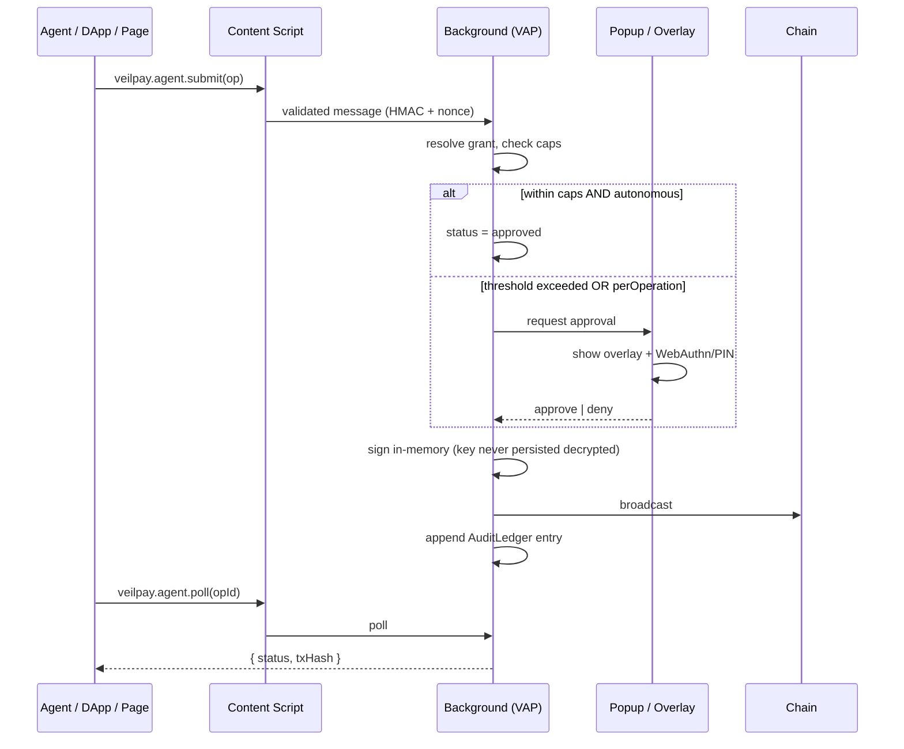

# Veilpay Extension — Native Payment Layer Spec (Paybox-Equivalent Capabilities)

**Document Version:** 1.0
**Last Updated:** 2026-08-08
**Scope:** Veilpay-native features. **No Paybox integration.** We build equivalent capability in-house, wired to the Veilpay privacy layer.

---

## 1. Design Decision: Build, Don't Integrate

Per requirement, Veilpay does **not** call `paybox.sh`, its API, its MCP endpoint, or its OAuth server. Instead we reimplement the capability class Paybox occupies — *scoped, revocable, agent-usable payment authority over vaulted credentials* — as a first-party Veilpay subsystem called **Veilpay Agent Payments (VAP)**.

| Paybox capability | Veilpay-native equivalent | Module |
|---|---|---|
| Vaulted credentials | Local encrypted vault (IndexedDB + AES-256-GCM, key from passphrase/WebAuthn) | `services/vault/` |
| MPC custody | **Not replicated.** Self-custody + optional Shamir split (`shamir-secret-sharing`, already in mobile deps) | `services/vault/ShardService.ts` |
| Scoped grants | Grant objects with caps, allowlists, expiry, revocation | `services/vap/GrantService.ts` |
| Passkey-gated approval | WebAuthn platform authenticator + PIN fallback + threshold policy | `services/auth/WebAuthnService.ts` |
| Submit → approve → poll | Operation state machine with durable queue | `services/vap/OperationService.ts` |
| Agent tool surface | Veilpay Agent RPC (page-injected `window.veilpay.agent`) + optional local MCP-style server | `content/agentProvider.ts` |
| Virtual cards | **Out of scope** (requires issuer/PCI partner). Documented as Phase 4 dependency. | — |
| x402 pay-per-use | First-class, both directions | `services/x402/` |
| Audit trail | Append-only signed local ledger | `services/vap/AuditLedger.ts` |
| Gas top-ups | Autonomous gas policy inside grant caps | `services/vap/GasPolicyService.ts` |
| Swap / DCA / staking | Phase 3 intent engine | `services/intents/` |

> **Honest boundary:** MPC custody and card issuance are the two Paybox capabilities we cannot replicate without third-party infrastructure (an MPC network and a card issuer/PCI vault). Everything else is buildable in-extension. These are flagged as explicit Phase 4 partner decisions, not silent gaps.

---

## 2. Core Object Model

```typescript
// packages: src/types/vap.ts

/** A credential the user has vaulted. Never leaves the device unencrypted. */
interface VaultedCredential {
  id: string;
  kind: 'wallet' | 'apiSecret' | 'x402Channel';
  label: string;
  chainFamily?: 'evm' | 'svm' | 'xlm';
  /** AES-256-GCM ciphertext; key derived from passphrase or WebAuthn PRF */
  ciphertext: string;
  iv: string;
  createdAt: number;
  lastUsedAt?: number;
}

/** A scoped, revocable authorization granted to a client (agent, dapp, site). */
interface Grant {
  id: string;
  clientId: string;              // origin or agent public key
  clientLabel: string;
  credentialIds: string[];       // what it may touch
  approvalMode: 'autonomous' | 'perOperation' | 'thresholdOnly';

  caps: {
    /** hard ceiling per single operation, in USD-equivalent minor units */
    maxPerOperation: bigint;
    /** rolling window ceiling */
    maxPerWindow: bigint;
    windowSeconds: number;
    /** above this, force user approval even in autonomous mode */
    approvalThreshold: bigint;
    /** allowed operation types */
    allowedOps: OperationType[];
    /** allowed chains */
    allowedChains: string[];
    /** allowed recipients / hosts; empty = any (discouraged) */
    allowlist: string[];
  };

  privacy: {
    /** force private mode for all ops under this grant */
    requirePrivate: boolean;
    /** allowed privacy levels */
    allowedLevels: PrivacyLevel[];
  };

  expiresAt: number;
  revokedAt?: number;
  createdAt: number;
}

type OperationType =
  | 'x402.pay'
  | 'transfer.public'
  | 'transfer.private'
  | 'gas.topup'
  | 'secret.reveal'
  | 'channel.open'
  | 'channel.settle';

type PrivacyLevel = 'public' | 'stealth' | 'encryptedNote' | 'shielded';

/** Every action flows through this state machine. */
interface Operation {
  id: string;
  grantId: string;
  type: OperationType;
  params: unknown;               // validated per-type with Zod
  status:
    | 'submitted'
    | 'awaitingApproval'
    | 'approved'
    | 'signing'
    | 'broadcast'
    | 'settled'
    | 'failed'
    | 'denied'
    | 'expired';
  amount?: bigint;
  chain?: string;
  privacyLevel?: PrivacyLevel;
  txHash?: string;
  error?: string;
  submittedAt: number;
  resolvedAt?: number;
  /** why it needed approval, for the audit trail */
  approvalReason?: 'threshold' | 'mode' | 'newClient' | 'allowlistMiss';
}
```

---

## 3. Request Lifecycle: Submit → Approve → Poll

This mirrors the Paybox pattern because it is the correct pattern for agent payments: the agent must never block on a human, and the human must never be bypassed.



### Approval decision function

```typescript
function requiresApproval(grant: Grant, op: Operation, spent: bigint): ApprovalDecision {
  if (grant.revokedAt) return { deny: true, reason: 'revoked' };
  if (Date.now() > grant.expiresAt) return { deny: true, reason: 'expired' };
  if (!grant.caps.allowedOps.includes(op.type)) return { deny: true, reason: 'opNotAllowed' };
  if (op.chain && !grant.caps.allowedChains.includes(op.chain))
    return { deny: true, reason: 'chainNotAllowed' };

  const amount = op.amount ?? 0n;
  if (amount > grant.caps.maxPerOperation) return { deny: true, reason: 'overPerOpCap' };
  if (spent + amount > grant.caps.maxPerWindow) return { deny: true, reason: 'overWindowCap' };

  if (op.type === 'secret.reveal') return { approve: 'required', reason: 'mode' };
  if (grant.approvalMode === 'perOperation') return { approve: 'required', reason: 'mode' };
  if (amount >= grant.caps.approvalThreshold) return { approve: 'required', reason: 'threshold' };
  if (grant.caps.allowlist.length > 0 && !inAllowlist(grant, op))
    return { approve: 'required', reason: 'allowlistMiss' };

  return { approve: 'auto' };
}
```

**Hard rules (non-negotiable):**
- `secret.reveal` **always** requires fresh user approval. No autonomous mode can bypass it.
- Grant creation and grant cap increases **always** require WebAuthn/PIN.
- A denied operation is terminal — agents must resubmit, never retry silently.
- Approval prompts are rate-limited (max 5/min) to prevent consent fatigue attacks.

---

## 4. x402 Agentic Payments — Both Directions

### 4.1 Consumer side (Veilpay pays)

Standard x402 flow: server answers `402 Payment Required`, extension satisfies it, request replays.

```
Page/agent fetch → 402 + WWW-Authenticate / x402 challenge
        ↓
Content script parses challenge:
  { scheme, amount, asset, chain, payTo, nonce, expiry, resource, description }
        ↓
BG: match to a Grant for this origin
        ↓
├─ auto-approved (under threshold) → sign payment payload
└─ needs approval → overlay: service, amount, chain, privacy mode
        ↓
Build payment:
  ├─ public: direct transfer / channel voucher
  └─ private: stealth recipient OR shielded (testnet)
        ↓
Attach X-PAYMENT header (signed payload) → replay request
        ↓
Server verifies → 200 + content
        ↓
AuditLedger entry + spend counter increment
```

**Challenge validation before any signing:**
- `expiry` in the future, `nonce` unseen (replay protection via seen-nonce LRU)
- `chain` in grant's `allowedChains`
- `amount` ≤ `maxPerOperation`
- `payTo` is a valid address for `chain`
- `resource` origin matches the page origin (no cross-origin payment redirection)

### 4.2 Provider side (Veilpay charges)

The user monetizes their own endpoint or agent service.

```
Screen: X402ProviderScreen
  ├─ Service name, description
  ├─ Price per request (asset + amount)
  ├─ Settlement chain + receiving address (or stealth meta-address)
  ├─ Privacy mode: public address | stealth meta-address (recommended)
  └─ Generate → returns:
       • challenge template (JSON) to serve on 402
       • verification snippet (Node/Express + Cloudflare Worker variants)
       • a verification key so the server can validate X-PAYMENT without Veilpay
```

Verification is **stateless and self-hostable** — the user's server checks a signature and a nullifier, no Veilpay backend call required. That keeps the provider side censorship-resistant and matches the self-custody thesis.

```typescript
// Emitted snippet (simplified)
verifyX402Payment({
  header: req.headers['x-payment'],
  expect: { amount, asset, chain, payTo, resource },
  seenNullifiers,   // caller-supplied store, prevents double-spend of a voucher
});
```

### 4.3 Micropayment channels

Per-request on-chain settlement is uneconomical below ~$0.10. So:

| Amount | Mechanism |
|---|---|
| < $0.01 | Off-chain signed voucher, batched; channel settles at cap or expiry |
| $0.01 – $1 | Payment channel increment (monotonic voucher, single settle tx) |
| > $1 | Direct on-chain transfer, optionally private |

Channel lifecycle: `channel.open` (fund + escrow) → N off-chain vouchers → `channel.settle` (highest voucher wins) → refund remainder. Vouchers are monotonic so the provider only ever submits the largest.

---

## 5. Privacy Layer Wiring

x402 payments are, by default, **linkable**: recipient, amount, and timing are public. This is the privacy hole in every existing agent-payment stack, and it is Veilpay's differentiator.

| Privacy level | What's hidden | Availability |
|---|---|---|
| `public` | nothing | all chains |
| `stealth` | recipient identity (one-time address per payment) | EVM Sepolia, Stellar testnet |
| `encryptedNote` | payment metadata / memo | EVM Sepolia, Stellar testnet |
| `shielded` | sender↔recipient link, via ZK pool | EVM Sepolia only (dev keys) |

### Stealth x402

Provider publishes a **meta-address** (`spendPub`, `viewPub`) in the challenge instead of a plain address. Payer derives a one-time address:

```
ephemeral e ← random
S = ECDH(e, viewPub)
oneTimeAddr = derive(spendPub, S)
publish ephemeralPub on-chain (announcement)
→ provider scans announcements with viewPriv, derives spend key
```

Result: every payment to the same service lands on a distinct address. On-chain, the provider's revenue is not aggregatable.

### Shielded x402 (testnet only)

Payer withdraws from the ZK pool directly to the provider's address. Public inputs `[merkleRoot, nullifierHash, recipient, amount, token]`, commitment `Poseidon(nullifier, secret, amount, token)` — same scheme as the mobile app's EVM pool, reusing `packages/circuits`.

**Mandatory UI truth-telling:**
> ⚠️ Testnet only. Proving keys are development keys from an unaudited setup. Not private against a determined adversary. Blocked on SEC-008 (ceremony) and SEC-011 (audit).

The extension **must** fail closed: if the privacy readiness check can't verify synced state, state-changing private ops are paused — exactly as the mobile app behaves for Private XLM.

### Privacy-preserving grants

A grant can pin `requirePrivate: true`, forcing every operation under it to use stealth or shielded mode. An agent operating under such a grant **cannot** emit a linkable payment even if it asks to.

---

## 6. Agent Interface

Two surfaces, both local, no remote dependency.

### 6.1 Page-injected provider

```typescript
window.veilpay.agent = {
  // capability discovery
  getCapabilities(): Promise<Capabilities>,

  // grant negotiation — always opens UI, never silent
  requestGrant(request: GrantRequest): Promise<{ grantId: string }>,

  // the lifecycle
  submit(op: OperationRequest): Promise<{ operationId: string; status: string }>,
  poll(operationId: string): Promise<OperationStatus>,
  cancel(operationId: string): Promise<void>,

  // x402 convenience
  payChallenge(challenge: X402Challenge): Promise<{ paymentHeader: string }>,

  // read-only
  listGrants(): Promise<PublicGrantView[]>,
  getAuditLog(filter): Promise<AuditEntry[]>,
};

// Standard EIP-1193 provider stays separate for dapp compat
window.veilpay.ethereum = { request({ method, params }) { /* ... */ } };
```

### 6.2 Local agent bridge (optional, opt-in)

For agents that run outside the browser (CLI, local LLM runtime), an opt-in loopback bridge on `127.0.0.1` exposing the same `submit/approve/poll` verbs over a tool-style JSON schema. Disabled by default; enabling it requires WebAuthn and shows a persistent indicator in the popup.

> **Security note:** this bridge is an unauthenticated-localhost risk if done naively. It is therefore token-gated (token shown once in the UI, required on every call), origin-checked, bound to loopback only, and auto-disabled when the wallet locks. It is a Phase 3 feature, not MVP.

---

## 7. Audit Ledger

Append-only, hash-chained, locally signed. Gives the user a provable history without a server.

```typescript
interface AuditEntry {
  seq: number;
  prevHash: string;              // hash chain → tamper-evident
  timestamp: number;
  actor: { kind: 'user' | 'agent' | 'dapp'; id: string; label: string };
  operationId?: string;
  grantId?: string;
  event:
    | 'grant.created' | 'grant.revoked' | 'grant.capChanged'
    | 'op.submitted' | 'op.approved' | 'op.denied' | 'op.settled' | 'op.failed'
    | 'secret.revealed' | 'wallet.unlocked' | 'wallet.locked'
    | 'vault.exported';
  detail: Record<string, unknown>;   // never contains key material
  hash: string;
}
```

Exportable as signed JSON/CSV. Redaction rule: amounts and addresses are logged; **nullifiers, secrets, mnemonics, and raw signatures are never logged**, per the mobile app's SECURITY.md rule.

---

## 8. Gas Policy (Autonomous Top-Up)

Agents stall when gas runs dry. A grant may carry a gas policy:

```typescript
interface GasPolicy {
  enabled: boolean;
  chains: string[];
  /** top up when native balance drops below this */
  floor: bigint;
  /** top up to this level */
  target: bigint;
  /** hard monthly ceiling on gas spend */
  monthlyCap: bigint;
  /** source: which credential funds the top-up */
  sourceCredentialId: string;
}
```

Top-ups are `gas.topup` operations — they pass through the same state machine, obey caps, and land in the audit ledger. They never require approval below `approvalThreshold`, which is the point.

---

## 9. Threat Model Additions (vs. Mobile App)

| Threat | Vector | Mitigation |
|---|---|---|
| **Malicious page requests grant** | Page calls `requestGrant` with huge caps | Grant UI shows caps in fiat, defaults to restrictive, requires WebAuthn, 3s anti-clickjack delay on first grant |
| **Consent fatigue** | Attacker spams approval prompts | Rate limit 5/min, auto-deny burst, "block this origin" one-click |
| **x402 challenge forgery** | MITM alters `payTo` | Challenge origin must match page origin; TLS required; `payTo` shown in overlay verbatim with chain badge |
| **Voucher replay** | Provider resubmits old voucher | Monotonic vouchers + nullifier store; only highest voucher settles |
| **Agent exfiltrates secret** | `secret.reveal` abuse | Always-approval, one-time reveal, clipboard auto-clear, audit entry, never in page DOM |
| **Localhost bridge hijack** | Any local process calls bridge | Token-gated, loopback-only, off by default, dies on wallet lock |
| **Cross-origin grant confusion** | Origin A uses origin B's grant | Grants keyed by origin; `clientId` bound at creation, verified per call |
| **Extension store supply chain** | Malicious update | Reproducible builds, published bundle hashes, GitHub release parity |
| **Privacy downgrade attack** | Page requests `public` when user wanted private | `requirePrivate` grants reject public ops; overlay shows privacy level prominently |

---

## 10. What We Deliberately Do Not Ship

Stating this plainly so it isn't mistaken for an oversight:

1. **MPC custody** — needs an MPC network. Self-custody + optional Shamir shards instead. Phase 4 partner decision.
2. **Virtual payment cards** — needs a card issuer + PCI DSS scope. Phase 4 partner decision.
3. **Mainnet SPP / Private XLM** — explicitly excluded per requirement. Testnet privacy flows only.
4. **Custodial fiat ramps** — excluded per requirement (fiat ramps out of scope).
5. **"Audited" claims** — no external audit exists. SEC-008 and SEC-011 gate any mainnet privacy language.

---

## 11. Acceptance Criteria

| ID | Criterion |
|---|---|
| VAP-01 | A grant cannot be created without WebAuthn or PIN confirmation |
| VAP-02 | `secret.reveal` always prompts, in every approval mode |
| VAP-03 | Exceeding `maxPerWindow` deterministically denies, never silently truncates |
| VAP-04 | Revoking a grant takes effect before the next `submit` returns |
| VAP-05 | Every state transition writes exactly one audit entry; chain verifies |
| VAP-06 | x402 consumer flow completes against a reference 402 server on Sepolia |
| VAP-07 | x402 provider verification snippet validates without any Veilpay network call |
| VAP-08 | A `requirePrivate` grant rejects a `transfer.public` op |
| VAP-09 | Stealth x402 produces a distinct recipient address per payment |
| VAP-10 | Wallet lock cancels all `awaitingApproval` operations |
| VAP-11 | No audit entry, log line, or page-visible object contains key material |
| VAP-12 | Shielded ops are unreachable on any mainnet chain in Phase 1 builds |

---

**Next Document:** `5_UI_COMPONENT_MAPPING.md`
