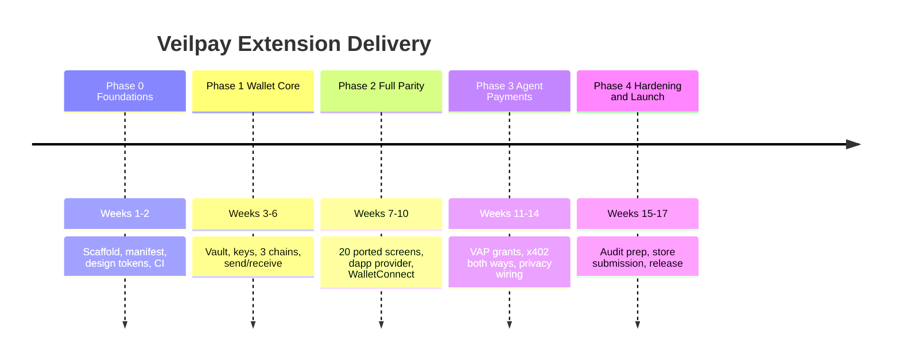

# Veilpay Extension — Implementation Roadmap

**Version:** 1.0
**Last Updated:** 2026-08-08
**Scope:** Phase 1 MVP (testnet) through Phase 4 (partner-dependent)

---

## Roadmap at a Glance

---

## Phase 0 — Foundations (Weeks 1–2)

**Goal:** A loadable, empty-but-correct extension with the design system in place and CI green.

| # | Task | Output | Depends on |
|---|---|---|---|
| 0.1 | Scaffold Vite + React 19 + TS, CRXJS plugin | `pnpm dev` hot-reloads in Chrome | — |
| 0.2 | Author `manifest.json` (v3) with minimal permissions | Loads unpacked, no warnings | 0.1 |
| 0.3 | Port `design-tokens.ts` verbatim from mobile | Same hex values, both themes | — |
| 0.4 | Build Tailwind preset from tokens | `bg-surface-card`, `text-accent` etc. resolve | 0.3 |
| 0.5 | Set up three entry points: popup, options, side panel | All three render "Veilpay" | 0.1, 0.2 |
| 0.6 | Background service worker + typed message bus | Round-trip ping with HMAC validation | 0.1 |
| 0.7 | Content script + isolated-world bridge | `window.veilpay` object present | 0.6 |
| 0.8 | CI: lint, typecheck, unit, build, bundle-size gate | GitHub Actions green, <5MB gzip | 0.1 |
| 0.9 | Port base components: Button, Card, Input, Modal, Icon, Toast | Storybook renders all, dark + light | 0.4 |

**Exit criteria:** Extension installs, popup opens in Veilpay dark theme, message bus proven, CI enforces bundle budget.

---

## Phase 1 — Wallet Core (Weeks 3–6)

**Goal:** A working self-custody wallet on three testnets. This is the riskiest phase — it owns key material.

### 1A. Vault & Key Management (Week 3)

| # | Task | Notes |
|---|---|---|
| 1.1 | `EncryptionService` — AES-256-GCM via Web Crypto | Key from PBKDF2(passphrase, 600k iters) or WebAuthn PRF |
| 1.2 | `VaultService` — IndexedDB store for encrypted mnemonic | Ciphertext + IV only; never a decrypted field |
| 1.3 | `KeyDerivationService` — BIP39 + BIP44 for evm/svm/xlm | `@scure/bip39`, `ed25519-hd-key`, `@noble/secp256k1` |
| 1.4 | In-memory key cache with explicit zeroization | Cleared on lock, on SW suspend, on tab close |
| 1.5 | `SessionService` — 15-min idle timeout, configurable 5–60 | Timer in SW; activity pings from popup/content |
| 1.6 | `WebAuthnService` + PIN fallback | Platform authenticator; PIN = Argon2id hash |
| 1.7 | Optional Shamir split of mnemonic (2-of-3) | `shamir-secret-sharing`, mirrors mobile dep |

**Security gate before 1B:** written self-review confirming no code path logs, returns to page context, or persists decrypted key material. Grep gate in CI for `mnemonic`, `privateKey` in log statements.

### 1B. Chain Services (Week 4)

| # | Task | Chain |
|---|---|---|
| 1.8 | `EVMService` — balance, fee estimate, sign, broadcast | Sepolia via viem |
| 1.9 | `SolanaService` — balance, SPL balances, sign, send | Devnet via @solana/web3.js |
| 1.10 | `StellarService` — balance, trustlines, sign, submit | Testnet via @stellar/stellar-sdk |
| 1.11 | `RPCService` — fallback rotation, 5-min response cache | Per-chain endpoint pools |
| 1.12 | `IndexerService` — tx history from Veilpay backend | Reuses mobile backend contract |

### 1C. Onboarding & Core Screens (Weeks 5–6)

| # | Screen | Source |
|---|---|---|
| 1.13 | `OnboardingFlow` (6 steps) | mobile `OnboardingScreen` |
| 1.14 | `CreateWalletModal` + seed display + forced verify | `CreateWalletScreen`, `VerifyWalletScreen` |
| 1.15 | `ImportWalletModal` | `ImportWalletScreen` |
| 1.16 | `SecuritySetupFlow` (PIN → WebAuthn → recovery → timeout) | `BiometricSetupScreen` |
| 1.17 | `UnlockScreen` | new (extension-only) |
| 1.18 | `DashboardView` — portfolio, assets, recent tx, quick actions | `HomeDashboardScreen` |
| 1.19 | `SendPaymentModal` → `ConfirmPaymentModal` → result | `SendCryptoScreen`, `PaymentConfirmScreen`, `PaymentResultScreen` |
| 1.20 | `ReceiveModal` with QR | `ReceiveScreen`, `DepositCryptoScreen` |

**Exit criteria:** Create wallet → receive testnet funds on all three chains → send on all three chains → history reflects it. Lock/unlock cycle loses no state and leaks no keys.

---

## Phase 2 — Full Mobile Parity (Weeks 7–10)

**Goal:** Everything the mobile app does, minus mainnet SPP and fiat ramps.

### 2A. Remaining Screens (Weeks 7–8)

| # | Screen | Source |
|---|---|---|
| 2.1 | `TransactionHistoryView` — sortable table, filters, CSV export | `TransactionHistoryScreen` |
| 2.2 | `TransactionDetailsModal` — timeline, explorer link | `TransactionDetailsScreen` |
| 2.3 | `PortfolioView` — token table, inline send | `BalancesAndAssetsScreen` |
| 2.4 | `SettingsLayout` — 7 sections, sidebar nav | `SettingsScreen` |
| 2.5 | `NetworkSettingsView` + `AddCustomNetworkModal` | `NetworkSettingsScreen`, `AddCustomNetworkScreen` |
| 2.6 | `AddressBookView` — CRUD, import/export JSON | mobile `addressBookStore` |
| 2.7 | `ExportKeyModal` — passphrase + WebAuthn + clipboard auto-clear | `ExportPrivateKeyScreen` |
| 2.8 | `SessionManagementView` | new (extension-only) |

### 2B. DApp Surface (Week 9)

| # | Task | Notes |
|---|---|---|
| 2.9 | EIP-1193 provider on `window.veilpay.ethereum` — **DONE** | `eth_requestAccounts`, `eth_sendTransaction`, `personal_sign`, `eth_chainId`, `wallet_switchEthereumChain` |
| 2.10 | Per-origin permission store + connection overlay — **DONE** | Approve once per origin, revocable in settings |
| 2.11 | Solana provider (`connect`, `signTransaction`, `signMessage`) — **DONE** | Solflare/Phantom-compatible shape |
| 2.12 | WalletConnect v2 — paste URI + QR image upload | `@walletconnect/sign-client`; no camera in extension |
| 2.13 | Right-click context menu (send to address, copy, lock) — **DONE** | Address regex detection on selection |

### 2C. State, Storage, Polish (Week 10)

| # | Task |
|---|---|
| 2.14 | All Zustand stores wired: wallet, transaction, settings, addressBook, privacy, vap, session |
| 2.15 | IndexedDB schema + migrations — **DONE** (additive v2 stores, indexes, reset clearing, migration marker) |
| 2.16 | `chrome.storage.local` for non-sensitive settings only |
| 2.17 | i18n scaffold + English strings extracted — **DONE** (typed English catalog, interpolation, persistence seam, incremental UI adoption) |
| 2.18 | Accessibility pass: WCAG 2.2 AA, keyboard nav, focus rings, ARIA — **DONE** (automated axe audit + token contrast math + real form labels) |
| 2.19 | Error boundaries + `ErrorState` / `EmptyState` everywhere |

**Exit criteria:** A user who knows the mobile app finds no missing capability except mainnet SPP and fiat ramps. Connects to a real testnet dapp and signs.

---

## Phase 3 — Agent Payments & Privacy (Weeks 11–14)

**Goal:** The differentiator. Native Paybox-class capability + x402 both directions + privacy wiring.

### 3A. VAP Core (Week 11)

| # | Task | Spec ref |
|---|---|---|
| 3.1 | `Grant` model + `GrantService` (create, list, revoke, cap edit) | §2, §3 |
| 3.2 | `OperationService` — submit/approve/poll state machine, durable queue | §3 |
| 3.3 | `requiresApproval()` decision function + rolling window spend counters | §3 |
| 3.4 | `AuditLedger` — hash-chained append-only, verify + export | §7 |
| 3.5 | Grant creation UI with fiat-denominated caps, 3s anti-clickjack delay | §9 |
| 3.6 | Approval overlay + rate limiting (5/min, burst auto-deny) | §9 |

**Hard gates:** VAP-01, VAP-02, VAP-03, VAP-04, VAP-05, VAP-10, VAP-11 from spec §11 must pass before 3B.

### 3B. x402 Consumer (Week 12)

| # | Task |
|---|---|
| 3.7 | `x402Interceptor` content script — detect 402 + parse challenge |
| 3.8 | Challenge validation: expiry, nonce LRU, chain allowlist, origin match, `payTo` format |
| 3.9 | `X402RequestOverlay` — service, amount, chain, privacy level, approve/deny, remember-choice |
| 3.10 | Payment payload signing + `X-PAYMENT` header + request replay |
| 3.11 | Reference 402 test server on Sepolia for e2e |

### 3C. x402 Provider + Channels (Week 13)

| # | Task |
|---|---|
| 3.12 | `X402ProviderScreen` — service config, price, settlement chain, stealth meta-address |
| 3.13 | Challenge template generator + self-hostable verification snippet (Express + CF Worker) |
| 3.14 | `PaymentChannelService` — open, monotonic vouchers, settle, refund |
| 3.15 | `PaymentChannelView` — channels list, spend/remaining, settle button, earnings |
| 3.16 | Tiered routing: voucher (<$0.01) / channel ($0.01–$1) / direct (>$1) |
| 3.17 | `GasPolicyService` — autonomous top-up within caps |

### 3D. Privacy Wiring (Week 14)

| # | Task | Availability |
|---|---|---|
| 3.18 | `StealthService` — ephemeral key, ECDH, one-time address derivation | EVM Sepolia, Stellar testnet |
| 3.19 | Background announcement scanner (non-blocking, chunked) | same |
| 3.20 | `EncryptedNoteService` — AES-256-GCM, ECDH-derived key, calldata/memo | same |
| 3.21 | `ZKProofService` — snarkjs Groth16 in Web Worker, Merkle proof | EVM Sepolia only |
| 3.22 | Stealth x402: provider meta-address → distinct address per payment | §5 |
| 3.23 | Shielded x402: pool withdrawal direct to provider | Sepolia, dev keys |
| 3.24 | `requirePrivate` grant enforcement — reject public ops | §5 |
| 3.25 | Fail-closed readiness check: pause private ops if state unsynced | mirrors mobile |
| 3.26 | Testnet + unaudited warning banners on every private surface | non-negotiable |
| 3.27 | Private XLM testnet flows: shield / private send / unshield | **testnet only, mainnet SPP blocked at config level** |

**Exit criteria:** VAP-06 through VAP-09 and VAP-12 pass. Shielded/mainnet combination is unreachable — verified by test, not by convention.

---

## Phase 4 — Hardening & Launch (Weeks 15–17)

### 4A. Testing (Week 15)

| # | Task | Target |
|---|---|---|
| 4.1 | Unit tests: services, stores, crypto, validation | ≥80% coverage |
| 4.2 | Integration: onboarding→send, x402 round-trip, stealth scan, session timeout, dapp connect | all green |
| 4.3 | E2E Playwright: full flows on Chrome | all green |
| 4.4 | Property tests on amount math + cap arithmetic (`fast-check`) | no overflow/underflow |
| 4.5 | Audit-ledger chain verification test | tamper detected |

### 4B. Security Review (Week 16)

| # | Task |
|---|---|
| 4.6 | Self-audit against spec §9 threat table — every row has a test or a documented residual |
| 4.7 | CSP tightened, no `unsafe-eval`; snarkjs WASM path verified under CSP |
| 4.8 | Secret-leak grep gate in CI (logs, DOM, audit entries, error messages) |
| 4.9 | Permission minimization review — justify every manifest permission |
| 4.10 | Reproducible build + published bundle hash |
| 4.11 | External audit scoping doc prepared (not the audit itself — that's a Phase 5 gate) |

### 4C. Release (Week 17)

| # | Task |
|---|---|
| 4.12 | Chrome Web Store listing: 5 screenshots, descriptions, privacy policy, permission justifications |
| 4.13 | GitHub release: source, `.zip`, release notes, bundle hash, dev-mode install guide |
| 4.14 | Docs: README, user guide, x402 provider integration guide |
| 4.15 | Support channels live (email, Discord) |
| 4.16 | Testnet-only messaging audited across store listing and in-app copy |

**Exit criteria:** Published on Chrome Web Store and GitHub. Every privacy claim in every surface is accurate and gated.

---

## Post-MVP Phases

### Phase 5 — Mainnet (gated, not scheduled)

Blocked on two things that are not engineering tasks:

| Gate | Blocks |
|---|---|
| **SEC-008** — multi-party Groth16 ceremony, published VK hashes | Any mainnet shielded pool |
| **SEC-011** — external security audit (contracts, circuits, extension) | Any "mainnet-ready privacy" claim |

Additional Phase 5 work: mainnet chain configs, certificate pinning, hardware wallet (Ledger/Trezor) production path, Firefox + Edge builds, transaction simulation preview.

### Phase 6 — Partner-Dependent

| Capability | Blocker |
|---|---|
| MPC custody | Requires an MPC network partner |
| Virtual payment cards | Requires card issuer + PCI DSS scope |
| Fiat ramps | Requires ramp provider + KYC jurisdiction work |
| Mainnet SPP / Private XLM | Explicitly out of extension scope |

### Phase 7 — Expansion

Intent engine (swap / DCA / staking), local agent bridge (§6.2), native privacy chains (Monero, Zcash, Midnight), multi-sig, mobile↔extension sync.

---

## Critical Path

```mermaid
graph LR
    A[0.1 Scaffold] --> B[0.6 Message bus]
    B --> C[1.1 Encryption]
    C --> D[1.2 Vault]
    D --> E[1.3 Key derivation]
    E --> F[1.8-1.10 Chain services]
    F --> G[1.19 Send flow]
    G --> H[3.1 Grants]
    H --> I[3.2 Operation machine]
    I --> J[3.7 x402 consumer]
    J --> K[3.22 Stealth x402]
    K --> L[4.6 Security review]
    L --> M[4.12 Launch]
```

Anything not on this chain can slip without moving the launch date. Anything on it cannot.

---

## Serial Sequence (Solo)

The original 3-stream parallel plan is void. With one developer, each stage is serial: stage N must be demonstrable before stage N+1 begins. Critical path reordering: the x402 always-prompt path ships before VAP grants, because grants exist to remove prompts and building them backwards would waste rework.

| Stage | What lands | Depends on |
|---|---|---|
| **S1 — Onboarding** | Popup → create phrase → verify → set passphrase → unlock → see empty account list. Store actions exist; this wires them to React. | Stage 0 (vault, handlers, bus) |
| **S2 — Account management** | Derive multiple accounts, switch chains, rename, view balances/transactions. Import existing phrase. | S1 |
| **S3 — Send flow** | Select asset → enter address → confirm → sign (EVM EIP-1559, Solana, Stellar) → broadcast. | S2 |
| **S4 — Agent payments (x402)** | Page-injected `window.veilpay.agent`, detect 402, build signed payload, replay, show confirmation. Always-prompt first. | S3 (signing primitives) |
| **S5 — VAP grants** | Persistent grant negotiation, scoped caps, auto-approve within budget, revoke. | S4 |
| **S6 — Privacy** | Stealth addresses, encrypted notes, ZK shielded (testnet-gated, unaudited-banner). snarkjs offscreen doc. | S2 (accounts) |
| **S7 — Polish** | Hardware wallet, multi-sig, batch settlements, agent bridge (Phase 5 gated), Chrome Store review build. | All prior |

---

## Risk Register

| Risk | Likelihood | Impact | Response |
|---|---|---|---|
| snarkjs WASM blocked by extension CSP | Medium | High | Probe written + wired to offscreen doc. Unexecuted — needs browser load. Fallback: ZK slips to Phase 5. |
| Service worker termination loses in-memory keys mid-operation | High | Medium | Operations are durable + resumable; SW death forces re-unlock, never a stuck op |
| Bundle exceeds 5MB with snarkjs .zkey files | Low | High | Measured 238 KB gzip without artifacts. .zkey files are 10s of MB and must be vendored. May exceed budget on their own. |
| x402 spec churn | Medium | Medium | Isolated behind `x402Adapter`. Proposed pin: tag `v1` (`ed97e2c`, 2025-12-09). `main` has already diverged header names. |
| Chrome review rejects crypto wallet or flags permissions | Medium | High | Submit a review-only build in week 15, two weeks before launch; minimize permissions |
| Privacy circuits from mobile don't port cleanly to browser | Medium | High | Spike before S6; fallback = defer to post-launch |
| Consent-fatigue UX makes agent payments annoying | Medium | Medium | Threshold tuning + remember-choice + usability test in S4 |
| No git version control | High | Low | Repo is initialized but has no commits. A single accidental `rm -rf` or drive failure loses all work. |

---

## Definition of Done (per task)

A task is done when all of these hold:

1. Code merged with typecheck and lint clean
2. Unit tests written and passing
3. If it touches key material: security self-review note in the PR
4. If it touches UI: dark + light theme verified, keyboard-navigable, AA contrast
5. If it touches money movement: tested on testnet end-to-end
6. If it adds a permission or a network call: justified in writing
7. No secret appears in logs, DOM, audit entries, or error strings

---

## Verification Note

This roadmap is a plan document. Nothing in it has been built or verified yet — no code exists in the project directory beyond these planning documents. Effort estimates are informed by the mobile app's scope as read from the repository, but they are estimates, not measurements.

---

**Related documents:** `1_EXECUTIVE_SUMMARY.md`, `2_DETAILED_PRD.md`, `3_ARCHITECTURE_DESIGN.md`, `4_NATIVE_PAYMENT_LAYER_SPEC.md`, `5_UI_COMPONENT_MAPPING.md`
