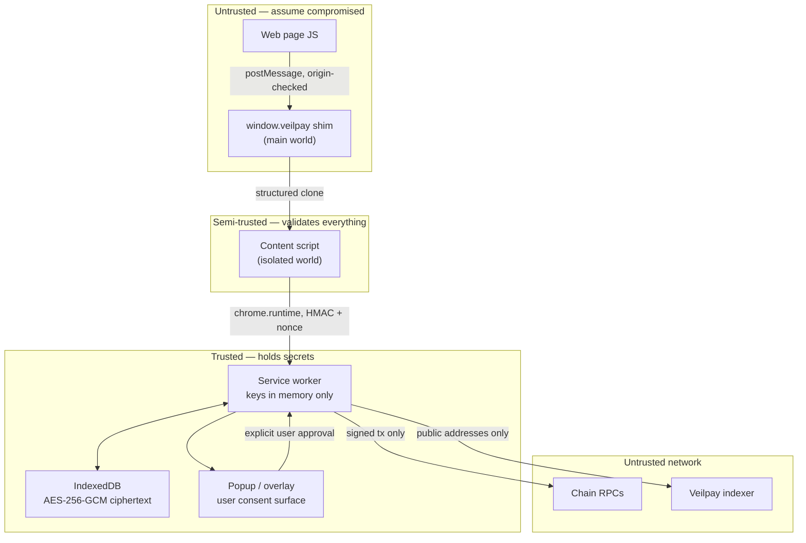

# Veilpay Extension — Security Model & Threat Analysis

**Version:** 1.0
**Last Updated:** 2026-08-08
**Inherits from:** Veilpay mobile `SECURITY.md`, `docs/security/security-model.md`
**Status:** Planning document. No code exists yet; nothing here has been verified in an implementation.

---

## 1. Why the Extension Needs Its Own Security Model

The mobile app's threat model does not transfer cleanly. A browser extension differs in four load-bearing ways:

| Difference | Consequence |
|---|---|
| **Shares a process with hostile web pages** | Any content-script mistake exposes key material to `evil.com` |
| **No hardware keystore** | Secure Enclave / Android Keystore have no browser equivalent. WebAuthn is auth, not storage |
| **Service worker is killed arbitrarily** | In-memory keys vanish mid-operation; state machine must survive it |
| **Agents can drive it** | An LLM or script can request payments — a threat class the mobile app doesn't have |

The mobile app's core invariant survives: **signing material never leaves the device and is never sent to the backend.** Everything below exists to keep that true in a hostile browser.

---

## 2. Trust Boundaries



**The invariant:** decrypted key material exists only inside the service worker's memory, only while unlocked, and crosses no boundary in this diagram. Not to the page. Not to the content script. Not to the popup. Not to the network.

---

## 3. Key Management

### 3.1 Storage Model

```
User passphrase ──PBKDF2-SHA256(600k iters, 32B random salt)──┐
                                                               ├──> KEK (256-bit)
WebAuthn PRF extension (if available) ─────────────────────────┘
                                                                     │
                                                    AES-256-GCM ─────┤
                                                                     ▼
                                            IndexedDB: { ciphertext, iv, salt, version }
```

**Rules:**
- The vault record contains **only** `ciphertext`, `iv`, `salt`, `kdfParams`, `version`. No plaintext field, ever — not even a "hint".
- KEK lives in service-worker memory, never in `chrome.storage`, never in IndexedDB.
- Derived per-chain private keys are computed on demand and zeroized after use.
- `chrome.storage.local` holds **non-sensitive settings only** (theme, language, network choice). It is trivially readable by anything with extension access.

### 3.2 Zeroization

JavaScript makes true zeroization impossible — strings are immutable and GC timing is not controllable. We do what is achievable and are honest about the residual:

```typescript
// Use Uint8Array for key material, never string
function withKey<T>(keyBytes: Uint8Array, fn: (k: Uint8Array) => T): T {
  try {
    return fn(keyBytes);
  } finally {
    keyBytes.fill(0);          // best-effort overwrite
  }
}
```

**Residual risk (accepted, documented):** a heap snapshot taken while the wallet is unlocked may contain key material. Mitigations are (a) short unlock windows, (b) lock on SW suspend, (c) never unlock for read-only operations. This is the same residual every browser wallet carries, including MetaMask.

### 3.3 Service Worker Death

Chrome terminates service workers aggressively (~30s idle). The wallet must treat this as normal, not exceptional:

| State | Behavior on SW termination |
|---|---|
| Locked | No change — nothing to lose |
| Unlocked, idle | KEK lost → wallet returns to locked. User re-authenticates. Correct outcome. |
| Mid-operation, pre-signing | Operation persists as `submitted`, resumes after unlock |
| Mid-operation, post-broadcast | Operation persists as `broadcast`, poller reconciles from chain |

**Anti-pattern we explicitly reject:** keeping the SW alive with a heartbeat to avoid re-authentication. That converts an idle timeout into a permanent unlock. If the SW dies, the user re-authenticates. That is the feature.

---

## 4. Session & Lock Semantics

| Setting | Value |
|---|---|
| Default idle timeout | 15 minutes |
| Configurable range | 5–60 minutes |
| Activity signals | popup interaction, approved operation, explicit unlock |
| **Not** activity signals | background polling, balance refresh, indexer sync, agent `poll()` calls |

That last row matters: if an agent's polling reset the idle timer, a grant with autonomous mode would keep the wallet unlocked forever. Agent traffic must never extend a session.

**On lock:**
1. Zeroize KEK and all cached derived keys
2. Cancel every operation in `awaitingApproval` (spec gate VAP-10)
3. Clear the approval overlay from all tabs
4. Disable the local agent bridge if enabled
5. Write `wallet.locked` to the audit ledger

---

## 5. Page & DApp Isolation

### 5.1 Three-World Model

| World | Contains | Trust |
|---|---|---|
| **Main world** | Page JS + thin `window.veilpay` shim | Zero |
| **Isolated world** | Content script, message validator | Low — it validates but holds nothing |
| **Extension world** | Service worker, keys, vault | Full |

The main-world shim is a message-forwarding stub only. It contains no keys, no addresses until granted, no logic worth attacking. Every message it forwards is re-validated in the isolated world and again in the SW.

### 5.2 Validation at Each Hop

```typescript
// Isolated world: never trust the shape
const Msg = z.object({
  channel: z.literal('veilpay'),
  id: z.string().uuid(),
  method: z.enum(ALLOWED_METHODS),
  params: z.unknown(),
  origin: z.string().url(),
});

window.addEventListener('message', (e) => {
  if (e.source !== window) return;                     // no cross-frame injection
  if (e.origin !== window.location.origin) return;     // no cross-origin sender
  const parsed = Msg.safeParse(e.data);
  if (!parsed.success) return;                          // silent drop, no error oracle
  if (parsed.data.origin !== window.location.origin) return;  // no origin spoofing
  forwardToServiceWorker(parsed.data);
});
```

### 5.3 Origin Binding

Every grant, permission, and payment channel is keyed to a **full origin** (scheme + host + port). Consequences:
- `https://app.example.com` and `https://evil.example.com` are distinct principals
- `http://` origins get no grants at all
- An iframe cannot borrow its parent's grant
- Origin is captured by the SW from `sender.origin`, never read from message payload

---

## 6. Approval UX as a Security Control

The approval overlay is the last line of defense. Attacks on it are attacks on consent itself.

| Attack | Defense |
|---|---|
| **Clickjacking** — overlay positioned under a decoy | Overlay renders in an extension-owned frame the page cannot style, position, or overlap; 3s interaction delay on first-ever grant per origin |
| **Consent fatigue** — spam prompts until user clicks through | Hard rate limit 5 prompts/min per origin; burst triggers auto-deny + one-click "block this origin" |
| **Amount obfuscation** — display 0.0001 ETH, sign 100 ETH | Overlay renders values parsed from the *signing payload*, not from page-supplied display strings; fiat equivalent shown alongside |
| **Recipient swap** — show friendly name, sign attacker address | Full `payTo` shown verbatim with chain badge; no ENS/nickname substitution on the confirmation surface |
| **Privacy downgrade** — request `public` where user expected private | Privacy level rendered prominently; `requirePrivate` grants reject public ops outright |
| **Blind signing** — opaque calldata | Decode known selectors; unknown calldata gets an explicit "cannot decode — proceed only if you trust this site" warning |

---

## 7. Agent-Specific Threats

These do not exist in the mobile app. They are the price of agentic payments.

| # | Threat | Mechanism | Mitigation |
|---|---|---|---|
| A1 | **Grant over-scoping** | Agent requests caps far above need | Caps shown in fiat; restrictive defaults; WebAuthn required; diff view on cap increase |
| A2 | **Slow drain** | Many sub-threshold payments | Rolling-window cap (`maxPerWindow`) independent of per-op cap; spend meter in popup |
| A3 | **Secret exfiltration** | Agent calls `secret.reveal` | Always requires fresh approval in every mode (VAP-02); one-time reveal; clipboard auto-clear; never written to page DOM |
| A4 | **Prompt injection → payment** | Web content instructs the agent to pay attacker | Extension is origin-bound and cap-bound; the agent's compromise cannot exceed its grant. Defense is the cap, not the agent's judgment |
| A5 | **Localhost bridge hijack** | Any local process calls the agent bridge | Off by default; token-gated (token shown once); loopback-only; dies on lock; persistent UI indicator when enabled |
| A6 | **Grant confusion** | Origin A uses origin B's grant | `clientId` bound at creation from `sender.origin`, re-verified per call |
| A7 | **Gas-policy abuse** | Repeated top-ups drain the funding source | `monthlyCap` on gas spend; top-ups are auditable operations, not invisible plumbing |
| A8 | **Revocation lag** | Op in flight when grant revoked | Revocation checked at approval time *and* immediately before signing (VAP-04) |

**On A4 specifically:** prompt injection against an LLM agent is not solvable at the wallet layer. We do not claim to solve it. The wallet's job is to bound the damage — an injected agent operating under a $5/day grant with a recipient allowlist can lose at most $5 to an allowlisted address. That is the actual mitigation, and it is a design constraint, not a patch.

---

## 8. x402-Specific Threats

| # | Threat | Mitigation |
|---|---|---|
| X1 | **Challenge forgery / MITM alters `payTo`** | TLS required; challenge resource origin must equal page origin; `payTo` shown verbatim in overlay |
| X2 | **Replay of a payment header** | Nonce LRU store; nonces single-use; `expiry` enforced |
| X3 | **Voucher replay by provider** | Vouchers monotonic; only highest settles; nullifier store on settle |
| X4 | **Amount inflation between display and sign** | Overlay reads the canonical parsed challenge, single source of truth |
| X5 | **Cross-origin payment redirection** | `resource` origin checked against page origin before signing |
| X6 | **Channel griefing** — provider never settles | Channel has expiry; user can unilaterally close after timeout and reclaim |
| X7 | **Provider learns full payment graph** | Stealth meta-addresses produce a distinct recipient per payment (spec §5) |

---

## 9. Privacy Layer: Honest Limits

The privacy features are the reason Veilpay exists, and they are also the easiest place to overclaim. The rules:

| Feature | What it actually hides | What it does NOT hide |
|---|---|---|
| **Stealth addresses** | Recipient identity; unlinkable across payments | Amount, timing, sender, gas payer |
| **Encrypted notes** | Memo/metadata contents | That a transaction happened, amount, parties |
| **Shielded pool (ZK)** | Link between deposit and withdrawal | Deposit amounts, timing correlation, pool anonymity-set size |

**Mandatory disclosure, on every private surface:**

> ⚠️ **Testnet only.** Proving keys come from an unaudited development setup (SEC-008 open). No external audit has been completed (SEC-011 open). Private transfers reduce public transaction detail but do not eliminate correlation risk — timing, amounts, and network-level metadata remain observable.

**Fail-closed requirement:** if private-state readiness cannot be *verified*, state-changing private operations are paused and the UI shows a readiness screen. This mirrors the mobile app's Private XLM behavior. Failing open — proceeding on an unverified private state — would silently degrade a private payment to a public one, which is worse than refusing.

**Hard configuration gate:** shielded operations are unreachable on any mainnet chain in Phase 1 builds. Enforced by a build-time chain allowlist and asserted by test (VAP-12), not by UI convention.

---

## 10. Content Security Policy

```json
{
  "content_security_policy": {
    "extension_pages": "script-src 'self' 'wasm-unsafe-eval'; object-src 'none'; base-uri 'none'; frame-ancestors 'none'"
  }
}
```

- `'wasm-unsafe-eval'` is required for snarkjs WASM proving. It is narrower than `'unsafe-eval'` and does not permit JS `eval`.
- No `'unsafe-inline'` for scripts. Styles use a hash or a stylesheet file.
- **Open risk:** if `'wasm-unsafe-eval'` proves insufficient for snarkjs under MV3, the fallback is an offscreen document; if that also fails, ZK proving slips to Phase 5. This is tracked as a Phase 0 spike, because discovering it in week 11 would be expensive.

---

## 11. Permission Minimization

Every manifest permission must be justified in writing or removed.

| Permission | Justification | Alternative considered |
|---|---|---|
| `storage` | Settings + vault metadata | None — required |
| `alarms` | Idle-timeout enforcement in SW | `setTimeout` dies with the SW; unusable |
| `activeTab` | Overlay injection on user action | Prefer over broad host permissions |
| `scripting` | Inject the provider shim | None — required for dapp compat |
| Host permissions | **Deliberately not `<all_urls>`** | x402 detection uses `activeTab` + user-initiated injection where possible |
| `webRequest` | **Rejected for MVP** | Broad, review-hostile; x402 detected via fetch/XHR patching in the shim instead |
| `tabs` | **Rejected** | `activeTab` suffices; full `tabs` reveals browsing history |

Rejecting `<all_urls>` and `webRequest` costs some x402 auto-detection convenience. The trade is worth it: it shrinks the blast radius of an extension compromise from "reads every page you visit" to "reads the page you clicked on."

---

## 12. Logging & Redaction

**Never logged, never in the DOM, never in an audit entry, never in an error message:**

- Mnemonics, private keys, KEK, derived keys
- Raw signatures (the tx hash is fine; the signature is not)
- ZK nullifier preimages, note secrets, commitment openings
- WebAuthn PRF output, PIN, PIN hash
- x402 channel secrets

**CI gate:** grep-based check failing the build if these identifiers appear within a log/console/throw expression. Crude, but it catches the common mistake.

Audit ledger entries record amounts, addresses, chains, origins, and outcomes — enough for the user to reconstruct what happened, never enough to steal funds.

---

## 13. Supply Chain

| Control | Implementation |
|---|---|
| Pinned dependencies | Exact versions in `package.json`; `pnpm-lock.yaml` committed |
| Dependency overrides | Mirror the mobile repo's `pnpm.overrides` for known-vulnerable transitives |
| Reproducible builds | Deterministic Vite build; publish bundle SHA-256 with each release |
| Release parity | Chrome Web Store bundle hash must match the GitHub release hash |
| Typosquat check | Manual review of any new dependency name before adding |
| Vendored circuits | Circuits bundled and hash-verified at build, not fetched at runtime |

Publishing bundle hashes matters specifically because Chrome Web Store auto-updates. A user who wants to verify they're running the audited code needs a hash to compare against.

---

## 14. Inherited Production Gates

From the mobile `SECURITY.md`, unchanged and binding:

| ID | Gate | Blocks |
|---|---|---|
| **SEC-008** | Multi-party Groth16 ceremony + published VK hashes | Mainnet deployment of any Groth16 verifier or proving key |
| **SEC-011** | External security audit | Any claim of "audited" or "mainnet-ready privacy" |

Extension-specific additions:

| ID | Gate | Blocks |
|---|---|---|
| **EXT-001** | Extension-scoped security review (isolation, CSP, permissions) | Chrome Web Store submission |
| **EXT-002** | All VAP acceptance criteria (spec §11) passing | Enabling agent payments for any user |
| **EXT-003** | Reproducible build + published hash | Any release |
| **EXT-004** | Mainnet chain allowlist empty in Phase 1 build, asserted by test | Phase 1 release |

---

## 15. Security Checklist (Phase 1)

### Cryptography & Keys
- [ ] Mnemonic generated from `crypto.getRandomValues` (CSPRNG)
- [ ] PBKDF2 ≥ 600k iterations, 32-byte random salt per vault
- [ ] AES-256-GCM with unique IV per encryption
- [ ] Key material held as `Uint8Array`, best-effort zeroized
- [ ] No plaintext key material in IndexedDB or `chrome.storage`
- [ ] EIP-155 chain binding on all EVM signatures
- [ ] Ed25519 for Solana, correct BIP44 path (`m/44'/501'/0'/0'`)

### Isolation
- [ ] Main-world shim contains no secrets and no logic
- [ ] Every message validated with Zod at every hop
- [ ] Origin taken from `sender.origin`, never from payload
- [ ] `e.source !== window` and origin checks on all `postMessage` handlers
- [ ] No `http://` origin receives a grant

### Session
- [ ] 15-min default idle lock, 5–60 configurable
- [ ] Agent polling does not reset the idle timer
- [ ] Lock cancels all `awaitingApproval` operations
- [ ] SW termination results in locked state, never in a stuck operation
- [ ] No keep-alive heartbeat defeating the idle timeout

### Consent
- [ ] Overlay unstylable and unpositionable by the page
- [ ] 3s delay on first grant per origin
- [ ] 5 prompts/min rate limit, burst auto-deny
- [ ] Amounts rendered from signing payload, with fiat equivalent
- [ ] `payTo` shown verbatim, no nickname substitution
- [ ] `secret.reveal` always prompts

### Privacy
- [ ] Testnet + unaudited banner on every private surface
- [ ] Fail-closed on unverifiable private state
- [ ] Mainnet shielded ops unreachable, asserted by test
- [ ] Stealth produces a distinct address per payment
- [ ] `requirePrivate` grants reject public operations

### Build & Release
- [ ] CSP has no `'unsafe-eval'` and no `'unsafe-inline'` for scripts
- [ ] No `<all_urls>`, no `webRequest`, no `tabs` permission
- [ ] Secret-leak grep gate passing in CI
- [ ] Bundle hash published and matching across distribution channels
- [ ] Every permission justified in `docs/`

---

## 16. Residual Risks (Accepted, Documented)

Stating these plainly rather than pretending they're solved:

1. **Heap-resident keys while unlocked.** JS cannot guarantee zeroization. Mitigated by short unlock windows, not eliminated.
2. **Malicious extension update.** Chrome auto-updates. Mitigated by published hashes; a user who doesn't check them is trusting the store.
3. **Compromised OS / browser.** Out of scope. A keylogger defeats every control here.
4. **Prompt injection against agents.** Bounded by grant caps, not prevented.
5. **Unaudited ZK circuits.** Testnet-gated and labeled. SEC-008/SEC-011 remain open.
6. **Timing and amount correlation in private payments.** Inherent to the primitives; disclosed in UI.
7. **No MPC, no hardware keystore.** Browser has neither. Optional Shamir shards reduce single-point-of-loss but not single-point-of-compromise.

---

## 17. Vulnerability Reporting

Inherits the mobile policy:

- **Do not** open a public GitHub issue for security bugs
- Email `veilpay@proton.me`, subject `[SECURITY] <short title>`
- Include description, repro steps, impact, suggested fix
- Acknowledgment target: 48 hours; coordinated disclosure

---

**Related:** `3_ARCHITECTURE_DESIGN.md`, `4_NATIVE_PAYMENT_LAYER_SPEC.md`, `6_IMPLEMENTATION_ROADMAP.md`
